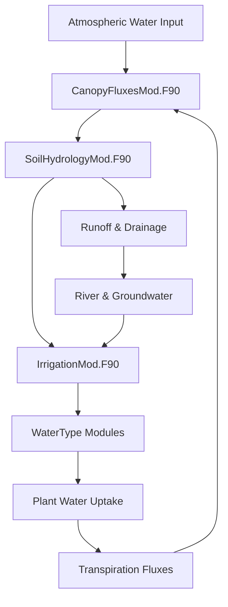

## Overview of Data Flow Architecture

CTSM follows a **hierarchical data flow pattern** with clear separation between:

- **State Variables**: Current system conditions (soil moisture, vegetation biomass, etc.)
- **Flux Variables**: Rates of change (photosynthesis, transpiration, etc.)
- **Parameter Data**: Configuration and physical constants
- **Forcing Data**: External drivers (meteorology, CO2 concentrations)


## Primary Data Flow Pathways

### 1. Main Driver Data Flow

```
Atmospheric Forcing → clm_driver.F90 → Component Drivers → Science Modules
                          ↓
                    State Updates → Output Systems
```

**Key Data Structures in Main Driver**

- **`clm_driver.F90`** (`src/main/`) orchestrates the primary data flow
- **`clm_drv_io.F90`** manages input/output data streams
- **`controlMod.F90`** handles run control and configuration data


### 2. Biogeochemical Data Flow Chain

Based on the repository structure in `src/biogeochem/`:

```
CNDriverMod.F90 (Master Coordinator)
        ↓
    State Initialization
        ↓
┌───────────────────────────────────────────────────────┐
│  CNPhenologyMod.F90 ← CNVegetationFacade.F90 →       │
│                              ↓                        │
│  SatellitePhenologyMod.F90 ← CNVegCarbonFluxType.F90  │
│                              ↓                        │
│              CNDecompMod.F90 (Soil Processes)         │
└───────────────────────────────────────────────────────┘
        ↓
    Flux Integration & State Updates
```

**Data Types Exchanged:**

- **Carbon Fluxes**: `CNVegCarbonFluxType` → `CNDecompMod`
- **Nitrogen States**: `CNVegetationFacade` ↔ `NutrientCompetitionMethodMod`
- **Phenology Status**: `CNPhenologyMod` → All vegetation modules
- **LAI Data**: `SatellitePhenologyMod` → `CNVegCarbonFluxType`


### 3. Human Dimensions Data Exchange

#### Irrigation System Data Flow

**Module**: `IrrigationMod.F90` (`src/biogeophys/`)

```
Soil Moisture States → IrrigationMod.F90 → Water Demand Calculation
                             ↓
Water Source Assessment → Supply-Demand Balance → Irrigation Fluxes
                             ↓
WaterType Modules ← Irrigation Application → SoilHydrologyMod.F90
```

**Key Data Exchanges:**

- **Input**: Soil matric potential, crop LAI, irrigation parameters
- **Output**: Water flux rates, groundwater withdrawal, irrigation timing
- **Interfaces**: `SoilHydrologyMod` (hydrology), `WaterType` (water balance)


#### Urban Data Flow

**Module**: `UrbanTimeVarType.F90` (`src/cpl/share_esmf/`)

```
Time-Varying Input Streams → Urban Parameter Processing
                                    ↓
Building Temperature Data → Air Conditioning Demand Calculation
                                    ↓
Urban Heat Island Effects → Surface Energy Balance Modification
```

**Key Data Exchanges:**

- **Input**: Building temperatures, AC adoption rates by urban density
- **Output**: Modified surface energy fluxes, urban heat contributions
- **Interfaces**: `LandunitType` (spatial organization), `UrbanParamsType` (parameters)


#### Agricultural Data Flow

**Module**: `CropType.F90` (`src/biogeochem/`)

```
Temperature Data → Growing Degree Day Accumulation → Phenological State
                                ↓
Crop Development Stage → Carbon Allocation Patterns → Harvest Timing
                                ↓
Tillage Operations (TillageMod.F90) → Soil Carbon Redistribution
```


## 4. Ecosystem Dynamics Data Flow

### FATES Integration

**Module**: `clmfates_interfaceMod.F90` (`src/utils/`)

```
CLM Biogeophysics → FATES Interface → Demographic Calculations
        ↓                               ↓
Surface Fluxes ←        Tree Populations & Size Distributions
        ↓                               ↓
Energy/Water Balance ← Canopy Structure → Light Competition
```

**Critical Data Exchanges:**

- **To FATES**: Soil moisture, temperature, radiation, CO2 concentration
- **From FATES**: Leaf area index, canopy height, vegetation cover fractions
- **Bidirectional**: Carbon fluxes, water fluxes, energy fluxes


### Satellite Phenology Integration

**Module**: `SatellitePhenologyMod.F90` (`src/biogeochem/`)

```
Satellite LAI Time Series → Temporal Interpolation → Current LAI
                                      ↓
Phenological Factors → CNVegCarbonFluxType → Photosynthesis Scaling
                                      ↓
Carbon Allocation → CNVegetationFacade → Growth Patterns
```


## 5. Cross-Component Data Interfaces

### Water Cycle Integration



**Key Data Types:**

- **Soil Moisture States**: Volumetric water content by soil layer
- **Water Fluxes**: Infiltration, transpiration, evaporation, drainage rates
- **Root Water Uptake**: Layer-specific extraction rates
- **Irrigation Fluxes**: Application rates and timing


### Carbon Cycle Integration

```
Atmospheric CO2 → Photosynthesis (CNVegCarbonFluxType)
                        ↓
    Carbon Allocation → Vegetation Pools → Litterfall
                        ↓                     ↓
    Growth Respiration   →    Soil Carbon Pools (CNDecompMod)
                              ↓
    Decomposition → Soil CO2 Emissions → Atmospheric CO2
```

**Key Data Types:**

- **Carbon Pools**: Leaf, stem, root, litter, soil organic matter
- **Carbon Fluxes**: Photosynthesis, respiration, allocation, decomposition
- **C:N Ratios**: Stoichiometric constraints on carbon processes


### Energy Balance Integration

```
Solar Radiation → Surface Energy Balance → Latent Heat Flux
       ↓                    ↓                    ↓
Canopy Absorption → Soil Temperature → Evapotranspiration
       ↓                    ↓                    ↓
Photosynthesis ← Biogeochemistry ← Water Availability
```


## 6. Data Structure Organization

### Spatial Hierarchy

Based on the repository structure in `src/main/`:

```
GridcellType (Climate forcing level)
    ↓
LandunitType (Land cover type level)
    ↓ 
ColumnType (Soil column level)
    ↓
PatchType (Plant functional type level)
```

**Data Aggregation Patterns:**

- **Patch → Column**: Area-weighted averaging for soil processes
- **Column → Landunit**: Hydrological integration
- **Landunit → Gridcell**: Surface flux aggregation


### Temporal Coordination

**Module**: `TimeMgrMod.F90` (`src/utils/`)

```
Model Timestep Control
    ↓
Process Scheduling (biogeophys → biogeochem → dynamics)
    ↓
State Variable Updates
    ↓
Flux Integration & Conservation Checks
```


## 7. Interface and Facade Patterns

### CNVegetationFacade Pattern

**Module**: `CNVegetationFacade.F90` (`src/biogeochem/`)

This module acts as a **central data hub** for vegetation processes:

```
External Modules → CNVegetationFacade → Internal Vegetation Modules
                        ↓
                Data Validation & Consistency Checks
                        ↓
                Unified State Management
```

**Functions as Interface:**

- **Input Processing**: Standardizes data from different sources
- **State Coordination**: Ensures consistent vegetation state across modules
- **Output Formatting**: Provides standardized data to external modules


### FATES Interface Pattern

**Module**: `clmfates_interfaceMod.F90` (`src/utils/`)

```
CLM Data Structures → Format Conversion → FATES Data Structures
                           ↓
                    FATES Calculations
                           ↓
FATES Results → Format Conversion → CLM Data Structures
```


## 8. Configuration and Parameter Data Flow

### Namelist Processing

**Modules**: `CLMBuildNamelist.pm` (`bld/`) and parameter files

```
Namelist Input → Parameter Validation → Module-Specific Parameters
                        ↓
Runtime Configuration → Science Module Initialization
                        ↓
Parameter Broadcasting → All Model Components
```


### Time-Varying Data Streams

**Module**: `dshr_strdata_mod` (coupling infrastructure)

```
External Data Files → Stream Processing → Temporal Interpolation
                            ↓
        Module-Specific Data → Runtime Application
```


## 9. Error Handling and Data Validation

### Conservation Checking

Implemented across modules for mass and energy conservation:

```
Process Calculations → Flux Summation → Conservation Check
                            ↓
        Error Detection → Diagnostic Output → Model Termination/Warning
```


### Data Bounds Checking

Each major module implements validation:

- **Physical Bounds**: Temperature, moisture, concentration limits
- **Consistency Checks**: Stoichiometric ratios, energy balance
- **Temporal Continuity**: Smooth state transitions


## 10. Performance and Memory Considerations

### Data Locality Patterns

- **Patch-level calculations**: Maximize cache efficiency
- **Column integration**: Minimize memory bandwidth
- **Gridcell aggregation**: Optimize for parallel reduction


### Memory Management

- **State variables**: Persistent across timesteps
- **Flux variables**: Temporary calculation arrays
- **Parameter data**: Read-only, shared across processors


