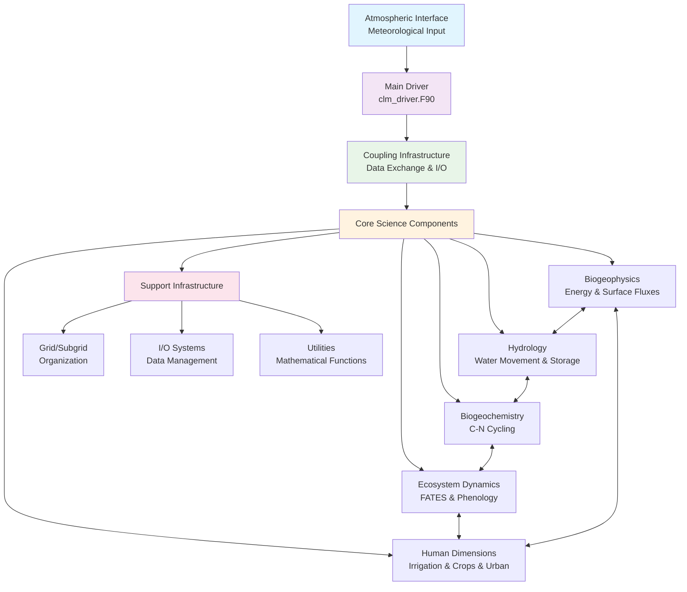
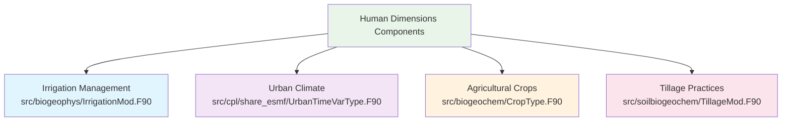
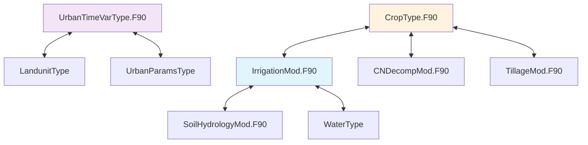
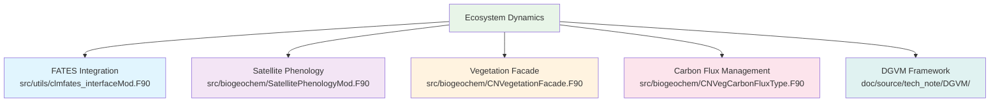
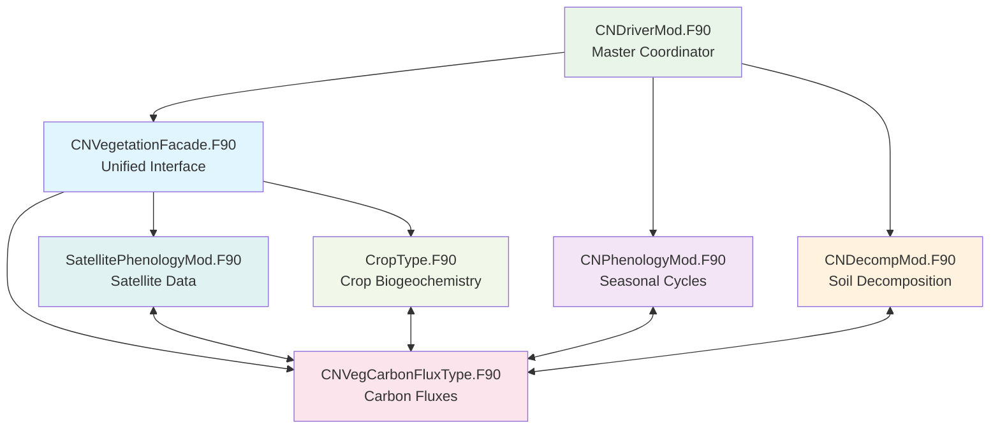
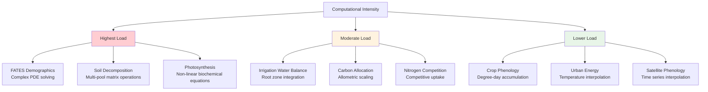
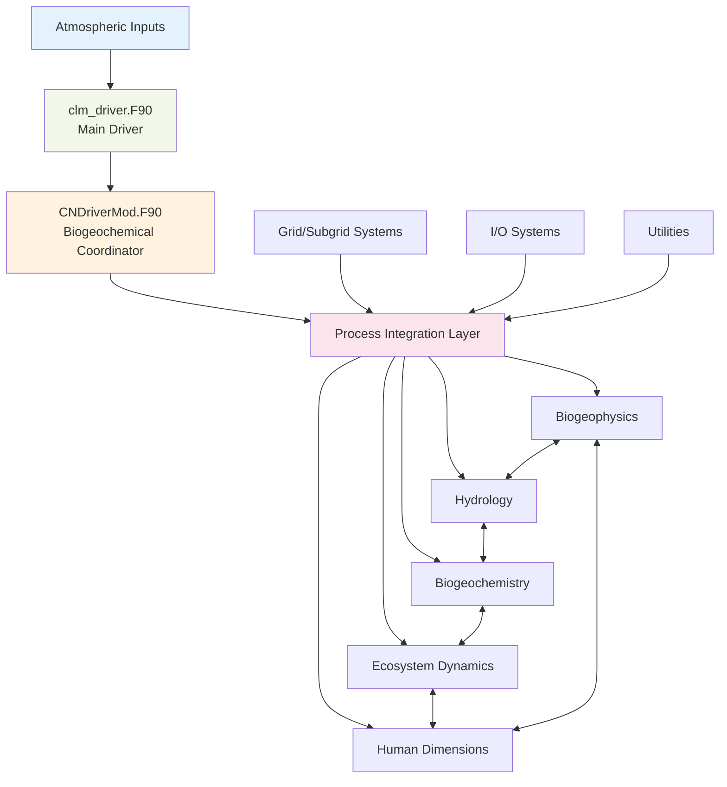
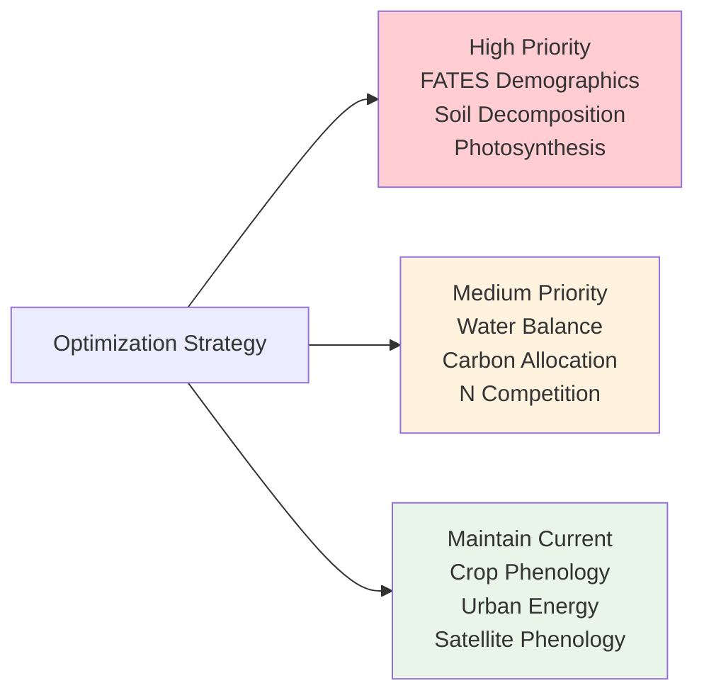

## System Architecture Overview

### CTSM System Architecture




### Component Data Flow


## Deep Dive: Human Dimensions Component

### Structure and Organization

The Human Dimensions components in CTSM are **distributed across multiple directories** based on functional roles rather than centralized in a single location.

### Component Distribution




### Key Components Details

#### Irrigation Management System

**Core Module**: `IrrigationMod.F90` (`src/biogeophys/`)

**Key Functions:**

- Soil water deficit calculations
- Multiple irrigation methods (drip, sprinkler)
- Water source management (surface water, groundwater)
- Supply-demand balancing

**Core Parameters:**

- `irrig_min_lai`: Minimum LAI threshold for irrigation
- `irrig_target_smp`: Target soil matric potential (-150,000 mm wilting point)
- `irrig_threshold_fraction`: Moisture threshold trigger


#### Urban Components

**Core Module**: `UrbanTimeVarType.F90` (`src/cpl/share_esmf/`)

**Urban Density Classes:**

- **TBD** (Tall Building Dense): High-rise urban core
- **HD** (High Density): Dense urban residential/commercial
- **MD** (Medium Density): Suburban development


#### Agricultural Management

**Core Module**: `CropType.F90` (`src/biogeochem/`)

**Key Processes:**

- Crop lifecycle management (planting, growth, harvest)
- Growth phases (emergence, grain fill, maturity)
- Residue management
- Integration with irrigation systems


### Human Dimensions Interdependencies




### Core Computational Kernels

#### Irrigation Water Balance Kernel

```fortran
! Primary Algorithm: Soil Water Deficit Calculation
irrigation_needed = max(0.0, target_moisture - current_soil_moisture)
irrigation_rate = min(irrigation_needed, max_irrigation_rate)
```

**Computational Operations:**

- Soil matric potential calculations
- Root zone integration across soil layers
- Time-of-day scheduling algorithms
- Supply-demand balancing iterations


#### Urban Energy Balance Kernel

**Computational Operations:**

- Temperature interpolation across urban density classes
- AC energy demand calculations
- Urban heat island surface energy modifications


#### Crop Growth Kernel

```fortran
! Primary Algorithm: Growing Degree Day Accumulation
growing_degree_days = growing_degree_days + max(0.0, daily_temp - base_temp)
```

**Computational Operations:**

- Phenological state transitions
- Harvest index calculations
- Heat unit accumulation through temperature integration


## Deep Dive: Ecosystem Dynamics Component

### Structure and Organization




### Key Components Details

#### FATES Integration Framework

**Primary Module**: `clmfates_interfaceMod.F90` (`src/utils/`)

**Core Capabilities:**

- Size-structured population dynamics for trees
- Light competition through multi-layer canopy modeling
- Mortality integration (background and disturbance)
- Growth rate calculations using allometric scaling


#### Satellite Phenology Module

**Primary Module**: `SatellitePhenologyMod.F90` (`src/biogeochem/`)

**Core Functions:**

- LAI data integration from satellite observations
- Seasonal cycle management
- Biogeochemical coupling with carbon allocation


#### Carbon Allocation System

**Primary Module**: `CNVegCarbonFluxType.F90` (`src/biogeochem/`)

**Key Processes:**

- Photosynthetic carbon uptake
- Carbon allocation to plant organs (leaves, stems, roots)
- Mortality and turnover fluxes
- Growth respiration calculations


### Ecosystem Dynamics Integration


### Core Computational Kernels

#### FATES Demographic Integration Kernel

**Most computationally intensive kernel**

**Computational Operations:**

- Size-structured population dynamics (PDE solving)
- Multi-layer canopy radiative transfer calculations
- Exponential decay functions for mortality
- Allometric scaling relationships (diameter-height-biomass)


#### Satellite Phenology Kernel

```fortran
! Primary Algorithm: LAI Time Series Processing
current_lai = linear_interpolate(lai_data, current_time)
phenology_factor = current_lai / max_lai
```

**Computational Operations:**

- Time series interpolation (linear and spline)
- Seasonal cycle fitting using Fourier analysis
- Statistical gap-filling for missing data


#### Carbon Allocation Kernel

**Computational Operations:**

- Priority-based allocation algorithms
- Allometric scaling calculations
- Mass balance conservation through iterative solving


## Deep Dive: Biogeochemistry Component

### Structure and Organization

**Primary Location**: `src/biogeochem/`

### Biogeochemistry Module Architecture




### Key Processes Modeled

**Major Biogeochemical Cycles:**

- **Carbon Cycle**: Photosynthesis, respiration, allocation, litterfall, decomposition
- **Nitrogen Cycle**: Uptake, mineralization, immobilization, loss
- **Plant Growth**: Carbon and nitrogen allocation to plant organs
- **Soil Processes**: Organic matter decomposition, nutrient cycling
- **Crop Biogeochemistry**: Crop growth, harvest, residue management


### Key Module Functions

| Module | Primary Function | Key Interactions |
| :-- | :-- | :-- |
| `CNDriverMod.F90` | Master biogeochemical coordinator | Calls all biogeochemical modules |
| `CNPhenologyMod.F90` | Plant seasonal cycles | Vegetation, crops, FATES |
| `CNVegetationFacade.F90` | Vegetation biogeochemistry interface | Biogeophysics, FATES, soil |
| `CNVegCarbonFluxType.F90` | Vegetation carbon flux management | Phenology, allocation systems |
| `CNDecompMod.F90` | Soil decomposition and nutrient cycling | Soil biogeochemistry, vegetation |
| `CropType.F90` | Crop-specific biogeochemistry | Irrigation, harvest, soil systems |

### Core Computational Kernels

#### Soil Decomposition Kernel

```fortran
! Primary Algorithm: Multi-Pool Decomposition Cascade
decomp_rate = base_rate * temp_factor * moisture_factor * pH_factor
pool_change = -decomp_rate * pool_size * timestep
```

**Computational Operations:**

- Arrhenius temperature response functions
- Multi-pool matrix operations for C-N transfers
- Michaelis-Menten kinetics for enzyme reactions
- Numerical integration (Forward Euler, semi-implicit methods)


#### Photosynthesis Kernel

```fortran
! Primary Algorithm: C3/C4 Biochemical Photosynthesis
carboxylation_rate = vcmax * ci / (ci + kc * (1 + oi/ko))
electron_transport_rate = j * ci / (4*ci + 8*gamma_star)
photosynthesis = min(carboxylation_rate, electron_transport_rate)
```

**Computational Operations:**

- Farquhar-von Caemmerer-Berry Model (C3 photosynthesis)
- Collatz Model (C4 photosynthesis)
- Leaf-to-canopy scaling with exponential light attenuation
- Stomatal conductance coupling with transpiration


#### Nitrogen Competition Kernel

```fortran
! Primary Algorithm: Plant-Microbe Competition
plant_uptake = plant_demand * available_n / (plant_demand + microbe_demand + kn)
microbe_uptake = microbe_demand * available_n / (plant_demand + microbe_demand + kn)
```

**Computational Operations:**

- Michaelis-Menten competition equations
- Root distribution vertical weighting
- Nitrogen budget equation solving


## Core Computational Kernels Summary

### Computational Intensity Ranking




### System Integration Framework




## Conclusion

### Key Findings

The Community Terrestrial Systems Model represents a sophisticated integration of physical, biogeochemical, and human dimensions of terrestrial systems. The modular architecture enables comprehensive Earth system modeling while maintaining computational efficiency through carefully designed component interfaces and optimized computational kernels.

**1. Distributed Human Dimensions**: Human activities are integrated throughout the codebase rather than isolated in separate modules, reflecting realistic Earth system coupling.

**2. Multi-Scale Ecosystem Dynamics**: The combination of FATES demographic modeling with satellite phenology provides comprehensive vegetation dynamics across temporal scales.

**3. Comprehensive Biogeochemistry**: Carbon and nitrogen cycling integration spans vegetation, soil, and human management systems.

**4. Computational Optimization Opportunities**: The highest computational loads occur in FATES demographic integration, soil decomposition matrix operations, and biochemical photosynthesis calculations.

### Recommendations



- Focus optimization efforts on the most computationally intensive kernels (FATES demographics, soil decomposition, photosynthesis)
- Maintain the integrated approach to human dimensions modeling
- Continue development of multi-scale ecosystem dynamics capabilities
- Preserve tight coupling between biogeochemical and biogeophysical processes

The CTSM framework provides a robust foundation for Earth system research, climate impact assessment, and global change studies through its comprehensive representation of terrestrial processes and human-environment interactions.

